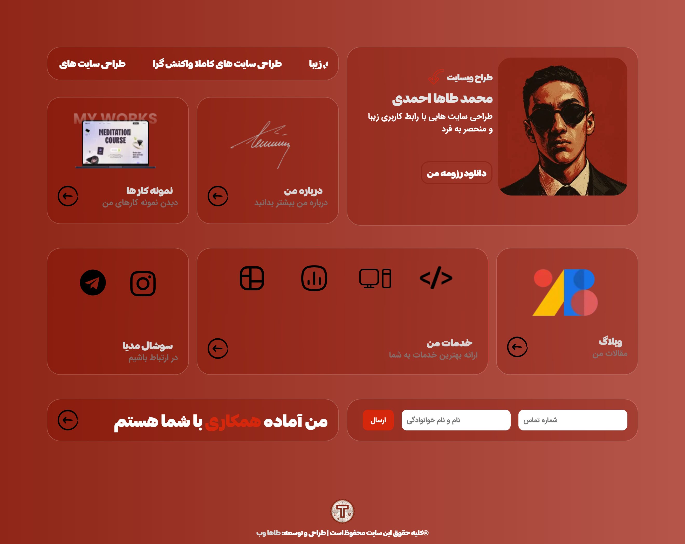
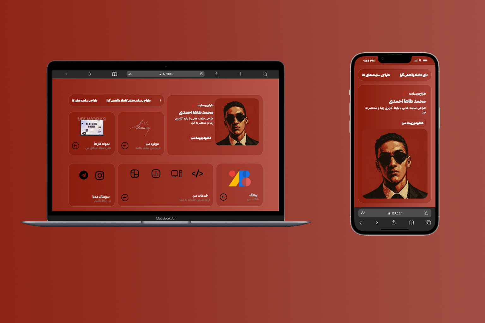

# Tahaweb — Previous Personal Portfolio

A modern and responsive personal portfolio website developed from scratch as an earlier version of my personal website.

## About the Project

Tahaweb is a previous version of my personal portfolio, created to introduce myself, showcase my projects, and present my front-end development work.

The website was designed and developed from scratch with a focus on clean visual design, responsive layouts, smooth interactions, and attention to UI details.

This project represents an earlier stage of my development journey and reflects my approach to building personal portfolio websites at that time.

## Key Features

* Modern and minimal portfolio design
* Responsive layout for desktop and mobile devices
* Custom UI implementation from scratch
* Smooth CSS animations and transitions
* Interactive elements and dynamic behaviors
* Dedicated sections for personal information and projects
* Mobile-friendly layouts
* Lightweight implementation without heavy CSS frameworks

## Technologies

* HTML5
* CSS3
* jQuery

## Screenshots

### Home Page — Desktop

### Home Page — Mobile

### About Me — Desktop

### About Me — Mobile

### Additional Preview

---

# نسخه فارسی

## درباره پروژه

Tahaweb نسخه قبلی وب‌سایت شخصی و پورتفولیوی من است که با هدف معرفی خودم، نمایش پروژه‌ها و ارائه بخشی از فعالیت‌های من در زمینه توسعه فرانت‌اند طراحی و از صفر پیاده‌سازی شده است.

در طراحی و توسعه این وب‌سایت تلاش کردم یک رابط کاربری مدرن و مینیمال ایجاد کنم و در کنار ظاهر بصری، روی ریسپانسیو بودن، تعاملات، انیمیشن‌ها و جزئیات رابط کاربری نیز تمرکز داشته باشم.

این پروژه مربوط به یکی از مراحل قبلی مسیر توسعه و یادگیری من است و بخشی از روند پیشرفت من در طراحی و توسعه وب‌سایت‌های شخصی را نشان می‌دهد.

## ویژگی‌های کلیدی

* طراحی مدرن و مینیمال
* طراحی ریسپانسیو برای دسکتاپ و موبایل
* پیاده‌سازی رابط کاربری از صفر
* استفاده از انیمیشن‌ها و ترنزیشن‌های CSS
* ایجاد عناصر تعاملی و رفتارهای پویا
* دارای بخش‌های اختصاصی برای معرفی شخصی و نمایش پروژه‌ها
* طراحی مناسب برای نمایش در موبایل
* پیاده‌سازی سبک و بدون وابستگی به فریم‌ورک‌های سنگین CSS

## تکنولوژی‌های استفاده‌شده

* HTML5
* CSS3
* jQuery

## تصاویر پروژه

### صفحه اصلی — دسکتاپ

### صفحه اصلی — موبایل

### صفحه درباره من — دسکتاپ

### صفحه درباره من — موبایل

### تصویر تکمیلی پروژه

